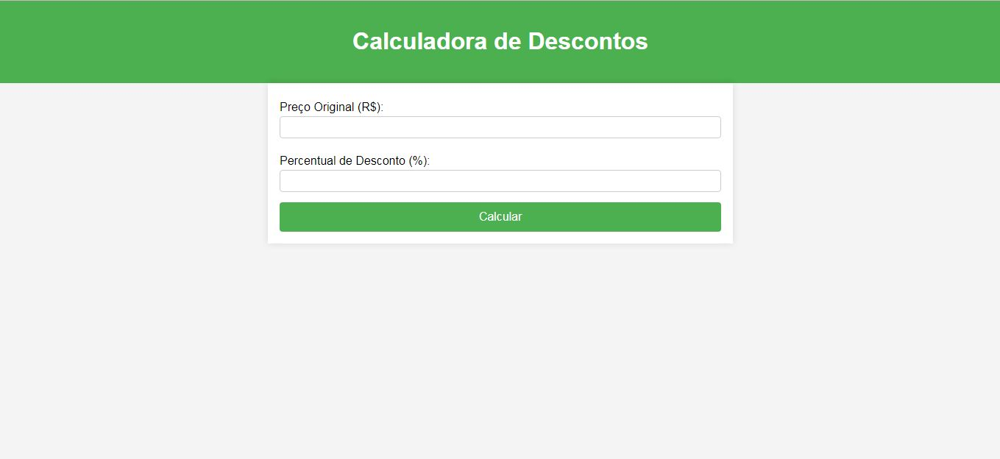

# Projeto Calculadora de Descontos
- A **Calculadora de Descontos** é uma aplicação web desenvolvida para ajudar usuários a calcular descontos em produtos de forma rápida e precisa. 
- Este projeto foi criado como parte de uma atividade de extensão universitária, com o objetivo de aplicar conhecimentos teóricos em uma solução prática e funcional.

## Capturas de tela do projeto



## Funcionalidades
- Inserção do preço original do produto.
- Inserção da porcentagem de desconto.
- Cálculo do preço final com o desconto aplicado.
- Interface simples e intuitiva.

## Tecnologias Utilizadas


## Estrutura do Projeto

```
calculadora-de-descontos/
│
├── static/
│   ├── css/
│   │   └── style.css
│
├── templates/
│   └── index.html
│
├── app.py
└── README.md
```

- `app.py`: Arquivo principal da aplicação Flask.
- `templates/index.html`: Arquivo HTML com a interface da calculadora.
- `static/css/style.css`: Arquivo CSS para estilização da página.
- `README.md`: Documento explicativo do projeto.

## Autor

- Nome: Thamires
- Contato: thamiresbranquini@gmail.com
- GitHub: [Meu GitHub](https://github.com/ranpoluv)
---